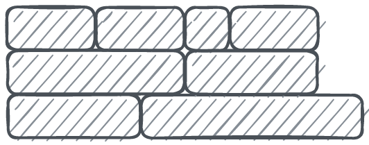
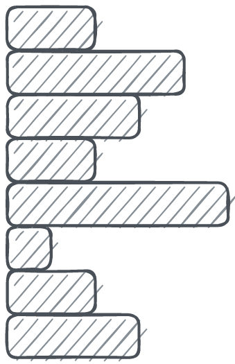

# star-all-settled
Supercharge your promises with parallel, sequential, pooled, and batched resolution

<table border="0">
  <tr>
    <th align="right">
      Type
    </th>
    <th>
      Execution Sequence
    </th>
  </tr>
  <tr>
    <td align="right">
      Sequential
    </td>
    <td>
      <picture>
        <source media="(prefers-color-scheme: dark)" srcset=".github/assets/sequential.dark.png">
        
      </picture>
    </td>
  </tr>
  <tr>
    <td align="right">
      Batched size = 2
    </td>
    <td>
      <picture>
        <source media="(prefers-color-scheme: dark)" srcset=".github/assets/batched.2.dark.png">
        
      </picture>
    </td>
  </tr>
  <tr>
    <td align="right">
      Batched size = 3
    </td>
    <td>
      <picture>
        <source media="(prefers-color-scheme: dark)" srcset=".github/assets/batched.3.dark.png">
        
      </picture>
    </td>
  </tr>
  <tr>
    <td align="right">
      Pooled size = 2
    </td>
    <td>
      <picture>
        <source media="(prefers-color-scheme: dark)" srcset=".github/assets/pooled.2.dark.png">
        
      </picture>
    </td>
  </tr>
  <tr>
    <td align="right">
      Pooled size = 3
    </td>
    <td>
      <picture>
        <source media="(prefers-color-scheme: dark)" srcset=".github/assets/pooled.3.dark.png">
        
      </picture>
    </td>
  </tr>
  <tr>
    <td align="right">
      Parallel
    </td>
    <td>
      <picture>
        <source media="(prefers-color-scheme: dark)" srcset=".github/assets/parallel.dark.png">
        
      </picture>
    </td>
  </tr>
</table>

